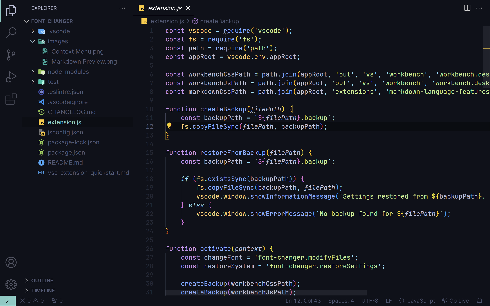

# UI Font Changer for VS Code

This extension changes the font of the entire UI to whatever font you choose.

The font must be installed on your PC.

# ⚠️ Disclaimer

**Written specifically for Windows**

This extension was written by ChatGPT, I was just debugging and feeding it ideas.

Based on this article by Kunal Tanwar - [Let's change VS Code UI font!](https://dev.to/kunaltanwar/how-to-change-vs-code-ui-font-in-windows-5e2e)

## Features

- Change the UI font, Markdown preview font and the context menu font
- Create a backup of your system default fonts
- Restore default fonts

## How to use

### Changing fonts

- Open the command palette (Ctrl + Shift + P)
- Search for "UI Font Changer - Change UI Font"
- Enter the name of the font (font must be installed on your PC)
- Restart VS Code
- Enjoy!

VS Code shows a warning after the font change -

Click on the gear icon and ingore it -

### Restoring system fonts

- Open the command palette (Crtl + Shift + P)
- Search for "UI Font Changer - Restore system settings"
- Restart VS Code
- Enjoy!

## Screenshots

### Using the font "Inter"

### UI

### Markdown preview

### Context menu

